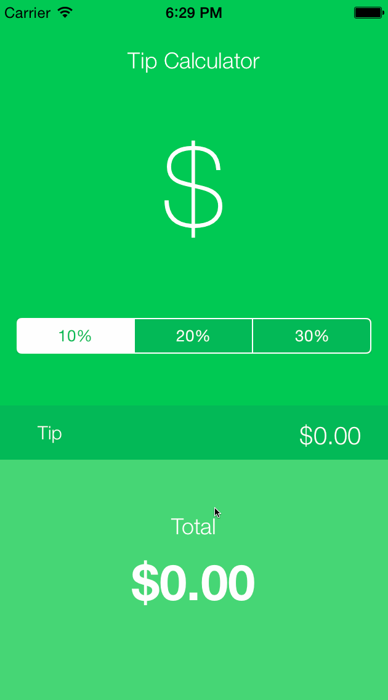

# Tip Calculator Demo
iOS Designers Bootcamp Pre Assignment

This is an iOS demo application for calculating tips. (Prework assignment for enrolment)

Time spent: 2 hours spent in total

* [x] Required: User can input bill amount
* [x] Required: User can select tip percentage
* [x] Required: User can view total $

Walkthrough of all user stories:

GIF created with [LiceCap](http://www.cockos.com/licecap/).
